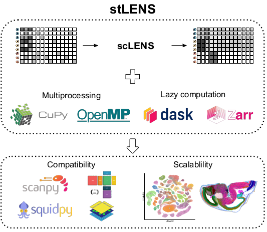

# stLENS

stLENS is a python-based scalable tool for determining the optimal number of principal components from spatial transcriptomics data.
It is designed to handle large-scale spatial omics datasets efficiently.

<p align="center">
  
</p>

## Features

- **Scalable Analysis**: Efficiently handles large spatial transcriptomics datasets
- **Optimal PC Selection**: Determines the optimal number of principal components using advanced statistical methods
- **scverse Compatible**: Seamlessly integrates with scanpy and other scverse tools
- **GPU Acceleration**: Leverages CUDA for high-performance computing
- **Spatial-aware**: Specifically designed for spatial transcriptomics data analysis

## Installation

### Prerequisites
- Python 3.9, 3.10, or 3.11
- CUDA-compatible GPU (for GPU acceleration)

### Install CuPy (Optional)
```bash
conda install cupy
```

### Install from PyPI
```bash
pip install stLENS
```

### Development Installation
```bash
git clone https://github.com/pnucolab/stLENS.git
cd stLENS
pip install -e .
```

## Quick Start

```python
from stLENS import stLENS
import scanpy as sc
import anndata as ad

# Load your spatial transcriptomics data
adata = sc.read_h5ad("your_spatial_data.h5ad")

# Initialize stLENS
stlens = stLENS()

# Determine optimal number of PCs
stlens.find_optimal_pc(adata)
```

## Documentation

For detailed documentation, tutorials, and API reference, visit:
**https://stlens.readthedocs.io/**

## Tutorials

We provide comprehensive tutorials and reproducible examples:

### Getting Started
- [Basic Tutorial](https://github.com/pnucolab/stLENS-tutorials/blob/main/tutorial.ipynb) - Introduction to stLENS basics and core functionality

### Paper Figure Reproduction
- [Spatial Analysis Tutorial](https://github.com/pnucolab/stLENS-tutorials/blob/main/spatial_notebook.ipynb) - Reproduce spatial transcriptomics results from our paper
- [Time Series Analysis](https://github.com/pnucolab/stLENS-tutorials/blob/main/time_notebook.ipynb) - Reproduce temporal analysis results from our paper


## License

This project is licensed under the BSD 3-Clause License - see the [LICENSE](LICENSE) file for details.
